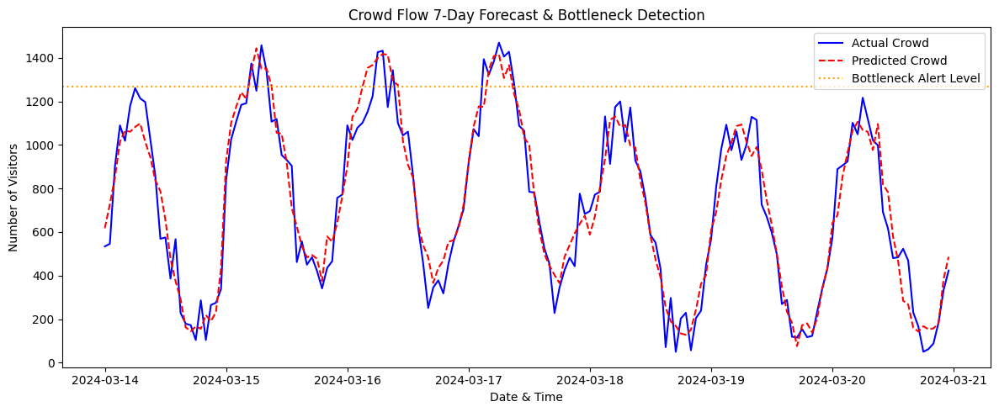

# 🚶‍♂️ Crowd Flow & Bottleneck Forecasting

A time-series machine learning project designed to forecast pedestrian flow patterns and predict crowd bottlenecks, supporting proactive crowd management and dispatching strategies (inspired by seasonal peak operations during Hajj & Umrah).

---

## 📌 Project Overview
- **Objective:** Predict visitor surge patterns and detect high-density bottlenecks using time-series forecasting.
- **Approach:** Engineered lag features (1h, 24h) and 6-hour rolling statistics to capture daily cyclic peaks and weekend trends.
- **Model:** Random Forest Regressor trained on chronological splits.
- **Bottleneck Detection:** Automated alert threshold triggering on the top 10% highest traffic volumes.

---

## 📊 Visualizations & Output

---

## 🛠️ Tech Stack & Libraries
- **Language:** Python
- **Data Manipulation:** Pandas, NumPy
- **Machine Learning:** Scikit-Learn
- **Data Visualization:** Matplotlib, Seaborn

---

## 📈 Key Outcomes
- Successfully captured recurring daily peak cycles and surge spikes.
- Identified potential bottleneck events in advance to assist operational routing and flow redirection.
